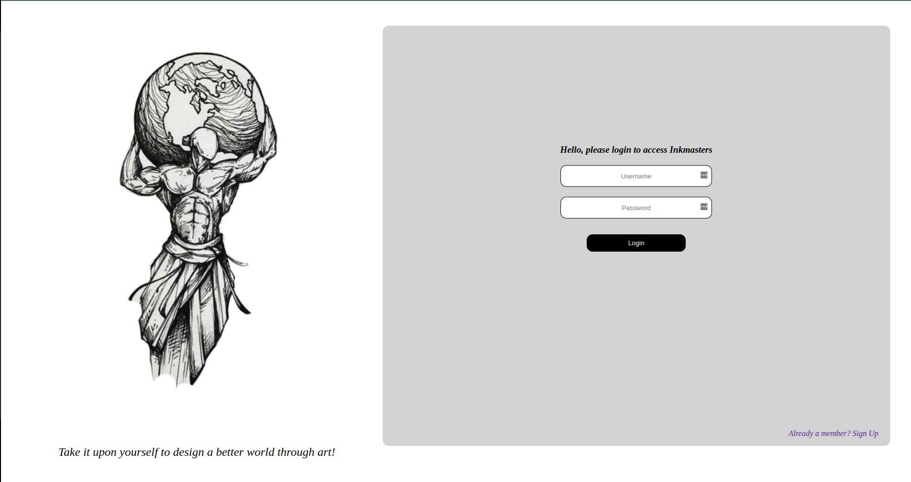
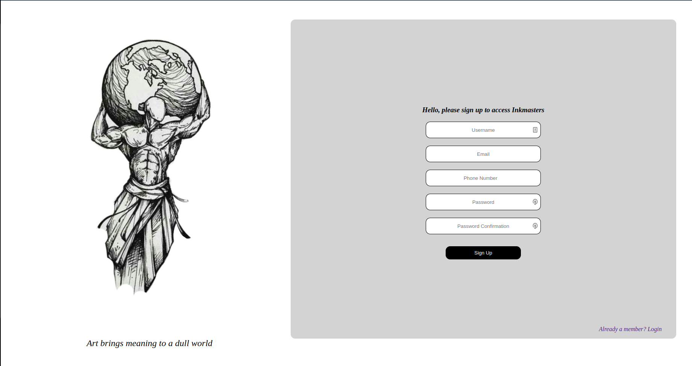
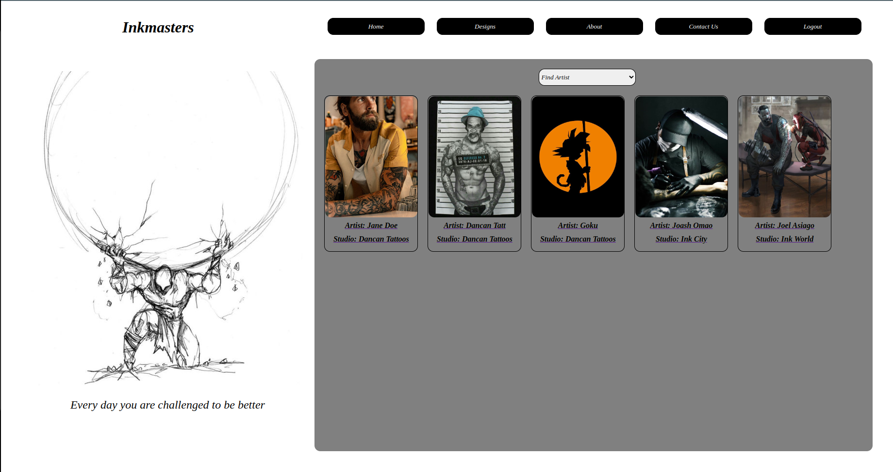
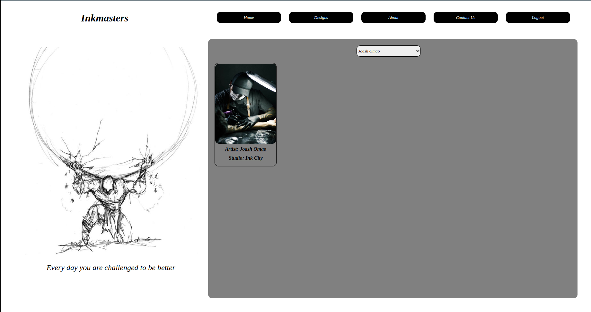
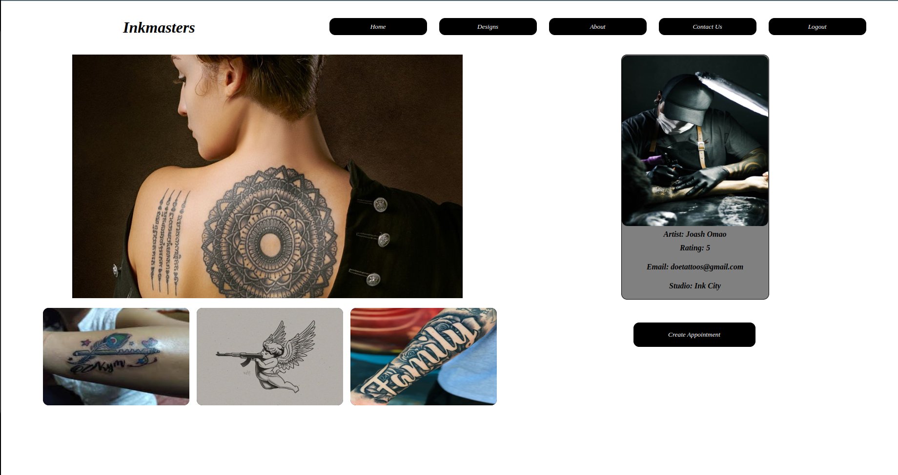

# Inkmasters

### Created by Joash Omao Machoka on December 8th 2022

## Description

Inkmasters exposes licensed tattoo artists to the world. It will ensure that tattoo lovers are linked to the best artists in the business.

## Screenshots
Site members will have to login to access the site. 

New members can access this page through the link on the login page. They have to sign up otherwise wont access the site.

The home page displays the registered artists.

Find a single artist card through the filter. Click the card to see the artist's work and information.

View an artist's work on the Artist page

## Link to the Website

[Inkmasters](https://stalwart-starship-7fb3de.netlify.app/)

## Setup Requirements

1. Visual Studio Code IDE
2. Chrome Web Browser
4. Git
5. Github (https://github.com/omaomach/LLearn)
6. Generated Railway url for fetching 
7. NPM (https://docs.npmjs.com/downloading-and-installing-node-js-and-npm) and NPX
8. Netlify for deploying the site.

## Development Server
I used Ruby on Rails to create the backend which was then deployed to Railway for consistent service.
[Inkmasters Backend](https://github.com/omaomach/inkmasters-backend)

## Languages Used
* HTML 5
* CSS
* Markup
* React JS
* Ruby

## Design Tools
I designed the site using Miro. The designs are as below:

[Miro](https://miro.com/app/board/uXjVP8m1-PA=/)

## Known Bugs
The project has no known Bugs

## Support and Contact Details
In the case that the project becomes captivating to the user in that he/she may want to share ideas on how to improve it, please contact me using my github email:

[Email](aaronjoash44@gmail.com)

## License
Copyright (c) 2022 Omao Machoka 
